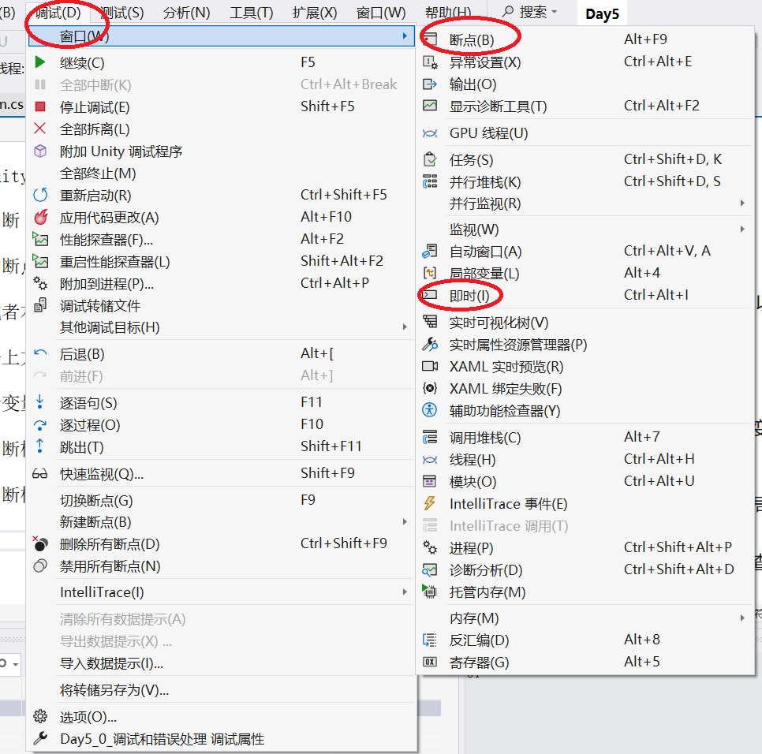
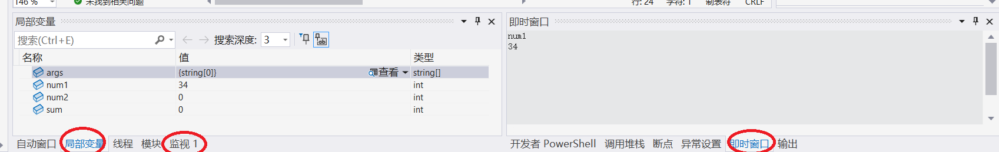
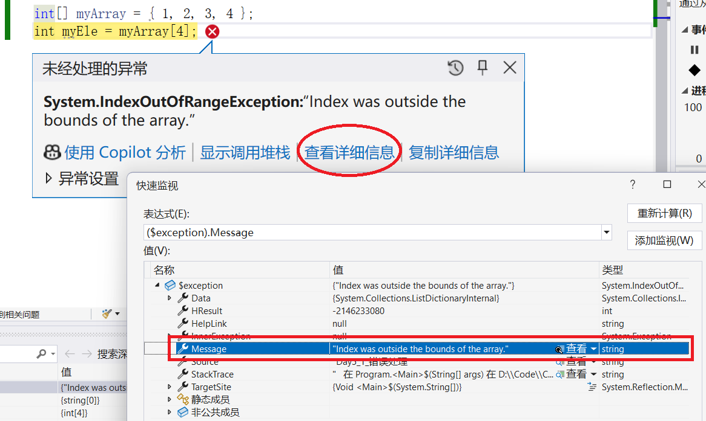
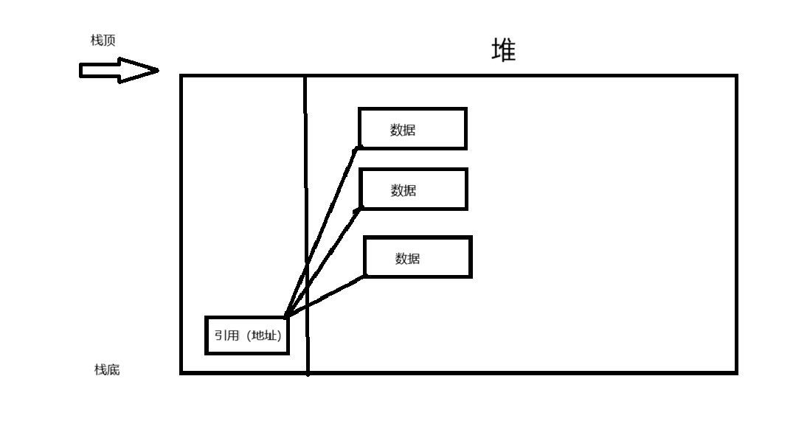
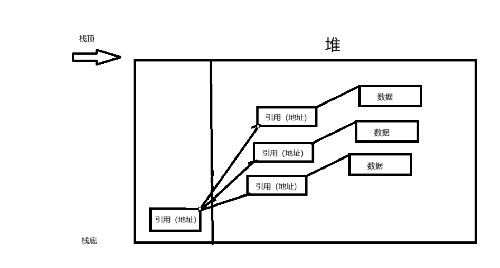

# 第二阶段
## 一.调试和错误处理

1.正常模式下（不影响程序正常运行）的调试：

在VS中，用Console.WriteLine方法，看值是否符合我们的预期

在unity中，用Debug.log("")、Debug.LogError("")和Debug.LogWarn("")

2.中断（debug（调试））模式下的调试：

**添加断点：**

F9或者右键添加断点。



点击上方调试->窗口->断点，打开断点（Breakpoints）窗口，可以看到所有断点

点击上方调试->窗口->即使，打开即时窗口，即时输入命令行，包括查看，修改，输入表达式。它是直接修改内部内存的

**查看变量内容：**



在中断模式下，鼠标放在变量名上；

在中断模式下，左下角的局部变量，或者可以点击监视，添加某个变量，追踪查看变量值的变化。

**调用堆栈：**

可以查看当前执行代码执行到哪一行了，被什么语句调用，还有执行此段代码已经调用的函数

**单步运行：**


```

F5：运行程序

F9:在光标处，增加断点

F10：逐过程运行

F11：逐语句运行

Shift+F11：跳出方法（跑完当前方法）

Shift+F5：停止调试（结束程序）

Ctrl+F10：运行到光标处
```

3.错误处理



出现错误，点击详细信息，查看Massage字段，可以看到是什么原因

try catch块，可以有0个或者多个

try块:可能出现异常的代码; 如果catch的参数不写，则表示发生任何异常都执行这个catch块

catch块:捕捉异常；

```csharp
try
{
}
catch (< exceptionType > e)//如果捕捉的异常类型不对，在发生别的类型的异常的时候，依然会终止程序运行
{
    throw;
}
```

finally块，可以有0个或者1个
不管是否有错误，都会执行
```csharp
finally
{
    Console.WriteLine("这里是finally");
}
```
## 2.堆和栈
我们把内存分为堆空间和栈空间。

栈空间比较小，但是读取速度块
堆空间比较打，但是读取速度慢

1.栈

数据只能从栈的顶端插入和删除，
把数据放入栈顶为入栈（push），把栈顶数据删掉为出栈（ pop ）

2.堆

堆就是内存的一块区域，与栈不同，能够以任意顺序存入和取出

3.GC GarbageCollector垃圾回收器

CLR是GC的内存管理机制，我们写程序不用担心内存的使用，就是CLR在帮助我们

4.值类型和引用类型

类型被分为两种：值类型（整数、bool、struct、char）和引用类型(数组、自定义类、内置类)

值类型:只需要单独的内存，用于存储实际数据（单独定义的时候放在栈中）

引用类型：需要两段内存，一段存储实际数据，它总是位于堆中。二段是一个引用，指向数据在堆中存放的位置（放在栈中）

当我们使用引用类型赋值的时候，其实赋值的是引用

如果数组是一个值类型数组，那么数组中直接存储值；如果数组是一个引用类型（数组中存储的是引用类型），那么数组中存储的是引用（内存地址）




## 3.面向对象编程
1.面向对象编程

面向对象编程也叫做OOP编程，它把程序按功能进行模块化，且每个模块都是孤立的。

简单来说，面向对象编程就是结构化编程，对程序中的变量进行结构划分，让编程更加清晰。

2.类是什么东西？

我们把类创建的变量叫做对象。

类就是创建对象的模板，每个对象都包含数据，并提供处理和访问数据的方法

类定义了类的每个对象，可以包含什么数据（变量）和功能（方法）。

类中数据和函数称为类的成员
```
数据成员（变量）
函数成员（方法）
```
```
（ps:怎么感觉和结构函数差不多？？？结构函数的进阶？）

两者定义的方式差不多，其他的却不一样。

struct和class是两套不同的建模工具

struct：像 Excel 里的一行数据

class：像一个“有行为、会变化的对象”
```
```
struct A
{
    public int X;
}

A a1 = new A { X = 10 };
A a2 = a1;   // 拷贝

a2.X = 20;
Console.WriteLine(a1.X); // ?
//答案是10
//相当于复制
```
```
class B
{
    public int X;
}

B b1 = new B { X = 10 };
B b2 = b1;   // 指向同一个对象

b2.X = 20;
Console.WriteLine(b1.X); // ?
//答案是20
//类似C的指针（ps:应该差不多）
```
```
（那为什么会保留struct，用class不是更好？）
主要原因：性能

struct 通常在 栈上

class 一定在 堆上，堆需要GC（垃圾回收），创建销毁都有成本。

如果创建一百万个Point
用class，GC压力巨大
而用struct，无GC，性能差距明显

结论：
class：描述“谁”
struct：描述“是什么”
```
2.构造函数

构造函数就是初始化的函数。

在我们new关键字段创建类就会自动调用构造方法
```
public class Class{
       public Class(){
       
       }
}
```
3.属性的定义
```
public int MyInPropl{
      get{
      
      }
      set{
      
      }
}
```
可以在set块中通过value来访问到我们设置的值。

简单理解，就是为了操作类内部对象而搞出的方法，即setget方法

另外，也可以通过set方法，在设置值之前做一些校验的工作；
把set、get方法选择性不写来实现只读或者只写；
```
        private string name;

        public string Name
        {
            get { return name; }
            set { name = value; }
        }
        //此代码所解释的意思和下面是一样的
```
```
 public string Name { get; set; }//编译器会自动给我们提供一个字段，来存储name
```
4.匿名类型

在前面的学习中，创建类型的时候必须指定类型。
但是也可以不指定，可以使用var来声明一个匿名类型。

使用var声明匿名类型，当初始化的时候，
这个变量的类型就被确定，并且以后不可以修改