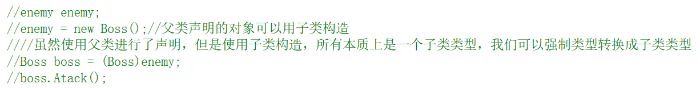
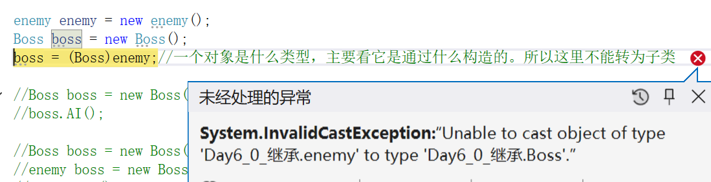
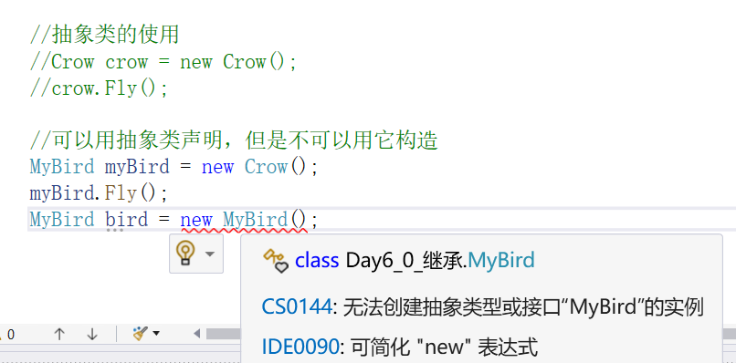
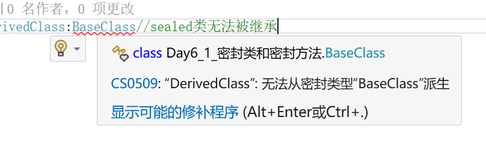
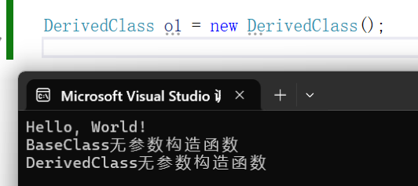
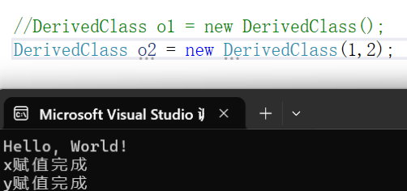
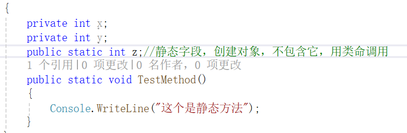

# 进阶二
## 三.面向对象编程

（5--10写在day6_0_继承里；11--13写在day6_0_派生类的构造函数里）

**5.继承**

实现继承：表示一个类型派生于一个基类型，它拥有该基类所有成员字段和函数。

接口继承：表示一个类型只继承了函数的签名，没继承任何实现代码；

（ps：C#不支持多重继承）

实现继承语法：
```
class MyDerivedClass:MyBaseclass
{
  //functions and data members here
}

//父类声明的对象可以用子类构造
//使用父类进行了声明，但是使用子类构造，所以本质上是一个子类类型，我们可以强制类型转换成子类类型
//一个对象是什么类型，主要看它是通过什么构造的。 
//子类可以直接转为父类
```




**6.虚方法**

把一个基类函数声明为virtual，就可以在任何派生类中重写该函数

```
class MyBaseClass{
      public virtual string VirtualMethod(){
      return;
      }
}
```

在派生类中重写另外一个函数的时候，使用override关键字显示声明

在子类里面重写虚函数之后（使用子类构造），不管在哪里调用都是调用重写之后的方法

如果虚函数在子类中，没有通过override关键字进行重写，
那么这个方法就没有被重写，只是被隐藏了（可以参考new关键字）

**7.隐藏方法（少用）**

如果签名相同的方法在基类和派生类中都进行了声明，
但是该方法没有分别声明为virtual和override,派生类就会隐基类方法。（要使用new关键字进行声明）

```
基类
class MyBaseClass{
      public int MyMethod(){
      
      }
}
```
```
派生类（隐藏款）

class MyDerivedClass:MyBaseClass{
      public new void  MyMethod(){
      
      }
}
```

**8.this和base关键字的作用**

this.:用来访问当前类所拥有的字段、属性和方法

base.：用来访问父类公有的字段和方法

**9.抽象类**

抽象类：抽象类不能实例化对象，可以包含普通函数和抽象函数，
抽象函数只有函数定义，没有函数体。显然，抽象函数也和virtual一样，也是需要重写的。
```
abstract class Building{
       public abstract decimal CalculateHeatingCost();
}
```



**10.密封类和密封方法**

C#允许把类和方法声明为sealed。对于类，这表示不能继承该类；
对于方法表示不能重写该方法

```
sealed FinalClass
{
//etc
}
```


**11.派生类的构造函数**

```
在子类调用构造函数
//先调用父类的，再调用子类的
//无参构造，base(),可以不写
public class MyDerivedClass{
       public MyDerivedClass():base(){
       
       }
}


//先调用父类的，再调用子类的
public class MyDerivedClass{
       public MyDerivedClass():base(){
       
       }
}

```




**12.访问修饰符protected和static**

public：都可以访问

private:外界无法访问，派生的子类也无法访问

protected：外界无法访问，派生类可以访问

static:它可以修饰字段或者方法。

当使用static修饰成员，该成员只能通过类名访问（静态方法（函数也一样））
。并且在构造此类的对象的时候，是不包含该成员的。



**13.定义和实现接口**

接口中只存在签名，不存在变量、函数和方法体。
它们都是公有的，不允许声明成员修饰符

接口是可以继承的

```
定义接口
public interface IFlyHandler{
      public void Fli();
}

实现接口
public class Type1Enemy:IFlyHandler{

}
```
