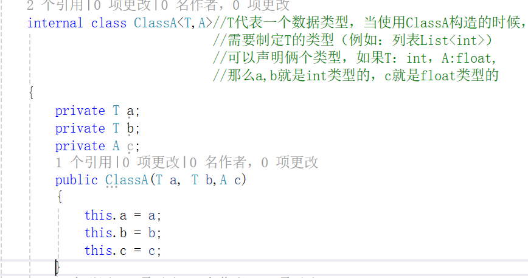
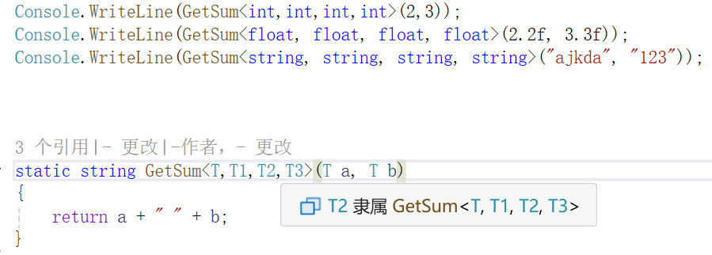

# List表
## List表的创建与使用
**1.List表的创建**

列表List可以很方便的添加、删除数据还有其他对数据的操作，并且大小不受限制。

```
//创建一个空的int类型的列表，<>表示列表的存储类型（泛型）
//List<int> scoreList = new List<int>();
//像列表添加数据1，2，3
//List<int> scoreList = new List<int>() { 1,2,3};
//创建一个初始容量为10的列表

//List<string> headers = new List<string>(10);
//感觉List像一个类，需要进行初始化
//列表容量刚开始是0，如果需要存储的元素个数大于0，容量就变为4，
//接着如果再超出，就变为8，以此类推
var scoreList = new List<int>();

scoreList.Add(12);//向列表中插入数据
scoreList.Add(45);

//通过索引访问列表中的数据
Console.WriteLine(scoreList[0]);//12
```
**2.列表的遍历**

1.for
```
for (int i = 0; i < scoreList.Count; i++)
{
    
}
```
2.foreach
```
foreach (var temp in scoreList)
{
    Console.Write(temp);
}
```
**3.操作列表的属性和方法**

Capacity:获取容量的大小

Add():添加元素

Insert()：插入元素

[index]:访问元素

Count:访问元素数量

RemoveAt():移除指定位置的元素

IndexOf():取得一个元素在所在列表中索引的位置，没找到指定元素返回-1

LastIndexOF():从后往前找，找到元素就停止，没找到返回-1

Sort()：对列表从小到大进行排序

## 泛型类
**1.泛型类的定义**

定义一个泛型类就是，这个类中的某些字段是不确定的，
这些类型可以在类构造的时候确定下来。

(有个类似的，不过是定义变量，var)

```
    internal class ClassA<T>//T代表一个数据类型，当使用ClassA构造的时候，需要制定T的类型（例如：列表List<int>）
    {
        private T a;
        private T b;
        public ClassA(T a, T b)
        {
            this.a = a;
            this.b = b;
        }
        public string GetSum()
        {
            return a +""+ b;
        }
    }
```

你可以指定多个泛型




**2.泛型方法**

同样的，泛型方法的参数类型是不确定的，
当调用这个方法的时候再去确定这个方法的参数

```
static string GetSum<T>(T a, T b)
{
    return a + " " + b;
}
```
当让你也可以指定多个泛型



# 字符串和正则表达式
## 字符串类
**1.string的基础使用**

1.创建字符串：string s = "kjsdakhsk";

2.获取字符串长度：int length = s.Length;

3.比较字符串是否一样：s == "xxx"

4.字符串的拼接：s = "http:" + s;

5.使用类似索引器的方法访问字符串中的字符：char read = s[0];

**2.string更多的方法**

CompareTo()：比较字符串里面的内容

Replace():用用另一个字符/字符串替换字符串中给定的字符/字符串

```
string s = "a.b.c";

string newStr = s.Replace('.', '-');//给定字符，替换字符

string newStr = s.Replace(".","----");//给定字符串，替换字符串
```

Split():在出现给定字符的地方，把字符串拆分成一个字符串数组

SubString():在字符串中检索给定位置的子字符串

```
string str = s.Substring(2,1);//表示从索引2开始，截取1个字符

//不给长度，表示截取从第二个字符开始，直到最后的字符串

Console.WriteLine(str);
```

ToLower()：把字符串转换成小写

ToUpper()：把字符串转换成大写

Trim():删除首尾空白(不管中间的空字符)

```
string s = " a.b.c ";

string str = s.Trim();

Console.WriteLine(str);
```

Concat()：合并字符串

Format()：格式化字符串

IndexOf()：取得字符串第一个出现某个给定字符串或者字符的位置
```
int index = s.IndexOf("b.");//如果包含返回第一次出现的索引
                            //不包含，返回-1

Console.WriteLine(index);
```
**3.StringBuilder类**

StringBuider的构造：
```
//1.利用构造函数创建StringBuilder
//StringBuilder sb = new StringBuilder("abcd");

//2.把容量设置为20，里面没有数据，占有20的大小
//StringBuilder sb = new StringBuilder(20);

//3.初始字符串adjha,容量大小为30
StringBuilder sb = new StringBuilder("adjha",30);

```
StringBuider与string的区别：

1.与string的差别，StringBuilder里面的字符串是可以变的

2.StringBuilder效率比string高（频繁的删除添加操作中）,string是复制操作，StringBuilder是添加
```
StringBuilder sb = new StringBuilder("adjha",30);//初始字符串adjha,容量大小为30
sb.Append("/xxx");//把此字符串添加到原字符串的后面
Console.WriteLine(sb.ToString());

String s = "123";
s = s + "/xxx";
Console.WriteLine(s);
```
**4.StringBuilder的更多方法**

Append():给当前字符串追加一个字符/字符串

Insert():追加特定格式的字符串

Remove():从当前字符串中删除字符

Replace():用用另一个字符/字符串替换字符串中给定的字符/字符串（和string一样）

ToString():把StringBuilder中存储的字符串，提取成一个不可变的字符串

# 正则表达式
（现在到了高阶，内容会选择性学习）
（一些内容，后面会慢慢补齐）