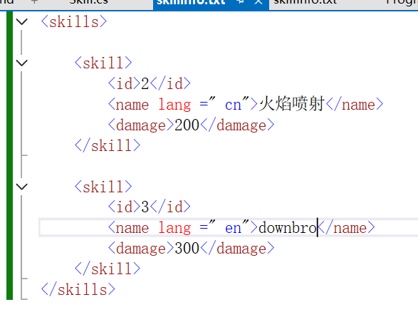

# 文件操作
## 查看文件属性
通过FileInfo和DerectoryInfo类来读取文件和文件夹属性
```
//相对路径：就是找当前程序所在的路径
FileInfo fileInfo = new FileInfo("TextFile1.txt");

//绝对路径：文件完整的路径名
FileInfo fileInfo = new FileInfo("D:\\Code\\C#_C_C++\\C#learning\\Day8\\Day8_0_查看文件属性\\TextFile1.txt");
```

Exists:判断该文件是否存在

Name:取得名字,文件名.后缀

Directory:查看文件所在路径

Length:获取文件大小，单位：字节

IsReadOnly:判断当前是否仅仅是可读的

Delete():文件删除,删除的是输出路径下的文件，工程下的文件还是存在的

CopyTo("tt.txt"):表示把这个文件复制到另外一个目录，不输入路径，就复制到当前目录下

MoveTo("test2.txt"):把文件以这个名字移动到另外一个目录,不输入路径，就复制到当前目录下,相当于重命名

```
FileInfo fileInfo = new FileInfo("test.txt");
if (fileInfo.Exists == false)
{
    //创建当前文件
    fileInfo.Create();
}
```
## 文件夹操作
和文件操作差不多，多了查看根目录和父目录
```
//文件夹操作
using System.IO;
//相对路径创建
//DirectoryInfo dirInfo = new DirectoryInfo("test2");
//if (dirInfo.Exists == false)
//{
//    //创建当前目录
//    dirInfo.Create();
//}
//绝对路径创建
DirectoryInfo dirInfo = new DirectoryInfo("D:\\Code\\C#_C_C++\\C#learning\\Day8\\Day8_0_查看文件属性\\bin\\Debug\\net8.0");//查看net8.0文件信息
//判断文件夹是否存在
Console.WriteLine(dirInfo.Exists);
Console.WriteLine(dirInfo.Name);
//查看它的父目录
Console.WriteLine(dirInfo.Parent);
//查看它的根目录
Console.WriteLine(dirInfo.Root);

//创建子目录,test
dirInfo.CreateSubdirectory("test");

```
## 文件读写
**1.File读写文件**

File.ReadAllLines("TextFile1.txt")：读取每一行，以换行符进行分割，返回string类的数组

File.ReadAllText("TextFile1.txt")：读取每一行，返回string类

File.ReadAllBytes("xxx.png")：读取非文本文件（图片）

File.WriteAllText("FileText2.txt","你好世界"):在当前运行目录下，创建该文件，写入"你好世界"。

File.WriteAllLines("FileText3.txt",new string[] {"w","ww","wayuduay"}):在每一行。分别写入string类数组的字符
```
//先读取再写入，相当于进行一个复制，只是名字不一样了
byte[] data = File.ReadAllBytes("xxx.png");
File.WriteAllBytes("test.png", data);
```
这些方法写入文件，会把当前文件内容删掉，再进行写入

**2.FileStream读写文件**

一般用于读取非文本文件（图片）,用的是字节

1 byte = 1 字节  1024byte = 1KB 1024KB = 1MB 1024MB = 1GB 1024GB = 1TB

```
//完成文件复制
FileStream readStream = new FileStream("xxx.png", FileMode.Open);

FileStream writeStream = new FileStream("copy.png",FileMode.Create);

byte[] data = new byte[1024];
while (true)
{
    //从0索引的位置填充数据，直到data.Length
    int length = readStream.Read(data, 0, data.Length);
    //如果length==0,文件就读取完了
    if(length == 0)
    {
        Console.WriteLine("读取结束");
        break;
    }
    else
    {
        //从0索引开始读,直到data.Length
        writeStream.Write(data, 0, length);
    }

}
writeStream.Close();
readStream.Close();
```
**3.StreamReader和StreamWriter读写文件**

用于处理文本文件
```
//文本文件读取流
StreamReader reader = new StreamReader("TextFile1.txt");
```
reader.ReadLine():读取一行数据,返回string类，读取完成返回空（null）

reader.ReadToEnd()：读取所有的字符

reader.Read()：读取一个字符，返回Asca码（整型），可以强制转为字符，读取完成返回-1

```
//文本文件写入流
//没有此文件会创建此文件，再写入；有，则覆盖写入
StreamWriter writer = new StreamWriter("TextFile2.txt");
```
writer.Write(message)：写入字符串/字符数组，没有换行

writer.WriteLine(message)：写入字符串，有换行

# 文档
## XML
**1.什么是XML？**

XML：指可标记语言，被设计来传输和存取数据，被设计用来结构化、存储以及信息传输

XML文档不会做任何事情，它仅仅是包装XML标签中纯粹的信息。

我们需要编写软件或者程序，才能传送、接收和显示处这个文档

**2.XML语法规则**

所有XML都必须有关闭标签
```
<p>  xxxx  </p>
```
对大小写敏感
```
<Message>  错的  </message>
<message>  对的  </message>
```
必须正确的嵌套
```
<b><i>  错  </b></i>
<b><i>  对  </i></b>
```
XML文档必须有根元素
```
<root>
 <child>

  </child>
</root>
```
XML的属性值需要加引号
```
<note date = "08/08/2008">
```
**3.XML语法操作**



流程：

创建XmlDocument对象，加载.xml文件

创建XmlNode对象，通过.FirstChild,找到根节点,即skill这个标签

创建XmlNodeList对象，通过.ChildNodes存放根节点下所有的节点，即skill

遍历该对象，在其中再创建XmlNodeList对象，存放此节点下的所有节点，即skill下的id、name和damage一类的标签

遍历第二List对象，取出值，添加到skillList

最后遍历skillList，输出。

（具体操作请查看代码）


